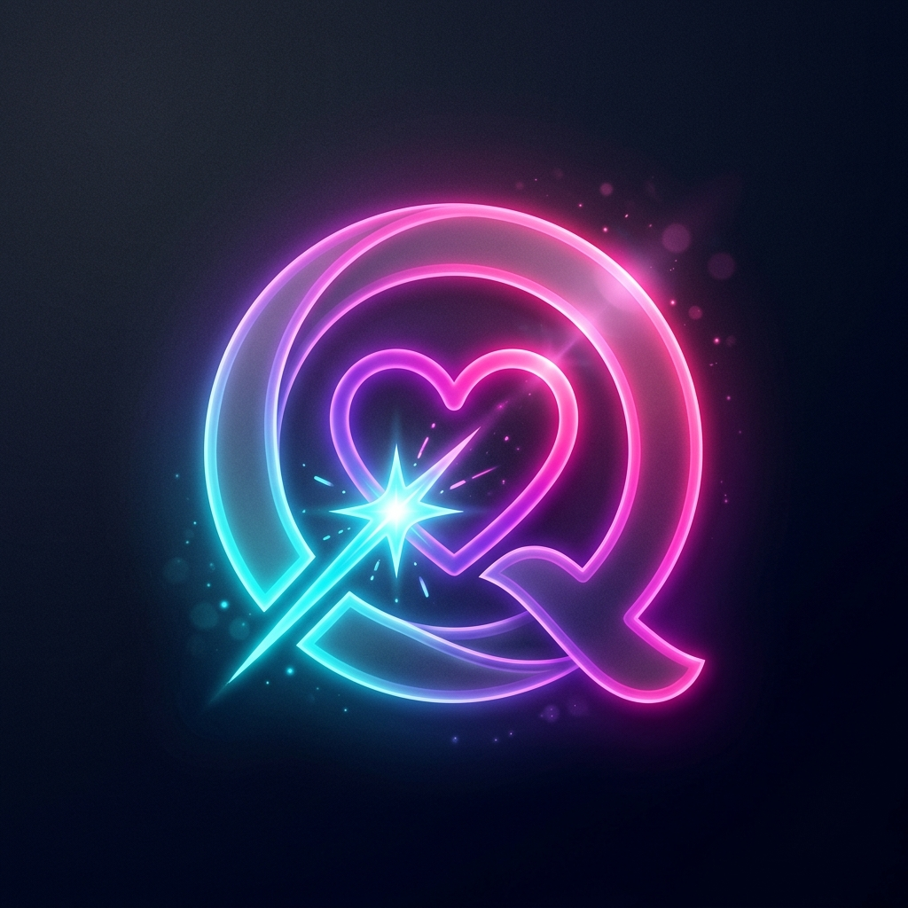

<div align="center">

  

  <h1>🔥 Q-Love Super App</h1>

  <p><strong>Siêu ứng dụng Hẹn hò, Mạng xã hội & Giải trí Thế hệ mới dành riêng cho Gen Z</strong></p>

  <p><em>"Vượt ra khỏi giới hạn của những ứng dụng vuốt chọn nhàm chán.<br>Q-Love mang đến một nền kinh tế ảo chân thực, những trò chơi sinh tồn kịch tính và trải nghiệm kết nối bùng nổ cảm xúc."</em></p>

  <br>

  [](#)
  [](#)
  [](#)
  [](#)
  [](#)

</div>

---

## 🌟 Cơ Hội Đầu Tư (Market Opportunity)

Thị trường ứng dụng hẹn hò đang chững lại với những mô hình "Freemium" lỗi thời. **Q-Love** ra đời để tái định nghĩa ngành công nghiệp tỷ đô này bằng cách kết hợp cơ chế ghép đôi (Matchmaking) với **Gamification (Trò chơi hóa)**, **Nền kinh tế ảo (Virtual Economy)**, và **Tương tác Offline-to-Online (O2O)**.

Dự án không phải là một mã nguồn mở. Q-Love là **Tài sản Trí tuệ độc quyền (Proprietary IP)** của Q-Tech, được thiết kế để tạo ra hệ sinh thái gây nghiện, có khả năng sinh lời ngay từ ngày đầu ra mắt (Day-1 Monetization).

---

## 💎 Đột Phá Lõi & Con Hào Kinh Tế (The Q-Love Moat)

Dự án sở hữu 3 "Đột phá lõi" được thiết kế đặc biệt để tối đa hóa khả năng giữ chân người dùng (Retention Rate), thúc đẩy chi tiêu (Monetization) và lan truyền tự nhiên (Viral Loop):

1. **Nền Kinh Tế Ảo Khép Kín (Virtual Economy & Tokenomics):**
   Thay vì chỉ bán các gói Premium truyền thống, Q-Love vận hành một sàn giao dịch thu nhỏ. Người dùng nạp "Xu Ảo" để đầu cơ, mua bán "Thẻ Bài Profile" của những cá nhân hot. Nền tảng tự động thu hồi (burn) Xu qua thuế giao dịch, đảm bảo nền kinh tế luôn cân bằng, chống lạm phát và tạo dòng tiền (Cash Flow) liên tục.
2. **Cơ Chế Viral & Drama Hóa (Community Gamification):**
   Tích hợp Tòa Án Tình Yêu, Tường Thành Phong Sát (Wall of Shame), và PK Cướp Thẻ. Bằng cách đánh vào tâm lý "hóng drama", sự tò mò và tính cạnh tranh của Gen Z, các tính năng này tạo ra động lực ép người dùng phải mở app và tương tác mỗi ngày.
3. **Mô Hình "Cò Mối" (Affiliate & Matchmaker):**
   Biến mỗi người dùng thành một "Đại sứ phát triển người dùng". Trao phần thưởng hoa hồng cho người dùng khi họ "ép duyên" thành công bạn bè của mình, tạo ra **Chi phí Thu hút Khách hàng (CAC) tiệm cận 0**.

---

## 🚀 Hệ Sinh Thái Tính Năng Đỉnh Cao (Feature Ecosystem)

*   **🃏 Chợ Thẻ Bài Profile:** Biến hồ sơ người dùng thành Thẻ Bài. Người dùng dùng Xu ảo để mua bán, đầu cơ thẻ bài của đối phương nhằm tìm kiếm lợi nhuận hoặc thể hiện đẳng cấp.
*   **⚖️ Tòa Án Tình Yêu & Tường Phong Sát:** Trừng phạt những kẻ bùng kèo hẹn hò. Kẻ thua kiện bị bêu tên công khai 24h trên Tường Phong Sát và bị cộng đồng "ném cà chua" (tốn Xu ảo).
*   **⚔️ PK Cướp Đoạt Thẻ Bài (The Steal):** Dùng thẻ Đạo Tặc mua bằng Xu để kích hoạt minigame đối kháng 10 giây. Người thắng sẽ cướp trắng Thẻ Bài Profile đắt giá từ tay kẻ khác.
*   **🎧 Vibe Check Nửa Đêm:** Đúng 23:00, "Đài Phát Thanh Tình Yêu" mở cửa. Tính năng ghép đôi ẩn danh hoàn toàn dựa trên bài hát đối phương đang nghe qua tích hợp API Spotify.
*   **🤖 AI Wingman (Trợ lý mỏ hỗn):** Tích hợp Agentic AI dự đoán tử vi/Tarot mỗi sáng và hỗ trợ người dùng đưa ra các gợi ý trả lời siêu mặn mòi, tăng vọt tỷ lệ phản hồi tin nhắn (Reply Rate).

---

## 🛠 Hướng Dẫn Cài Đặt (Local Development)

### 1. Yêu cầu hệ thống
- **Go** >= 1.21
- **Flutter** >= 3.22 (Tùy chọn nếu chỉ chạy Backend)
- **PostgreSQL** >= 14 (Có hỗ trợ PostGIS)
- **Redis** >= 6.0
- **golang-migrate** (Công cụ chạy migration: `go install -tags 'postgres' github.com/golang-migrate/migrate/v4/cmd/migrate@latest`)

### 2. Thiết lập Backend (Golang)

1. Sao chép cấu hình môi trường:
   ```bash
   cd backend/server
   cp .env.example .env
   # Sửa các giá trị trong .env (DATABASE_DSN, JWT_SECRET, Redis, Sentry...)
   ```

2. Chạy Database Migrations:
   ```bash
   make migrate-up
   # Để rollback, dùng lệnh: make migrate-down
   ```

3. Khởi chạy Server:
   ```bash
   make run
   # Server sẽ chạy tại http://localhost:3000
   ```

---

## 🔬 Động Cơ Kỹ Thuật Độc Quyền (Proprietary Tech Engine)

Kiến trúc của Q-Love được xây dựng chuẩn mực cho K8s Scaling, đáp ứng hàng triệu người dùng đồng thời (CCU):

*   **Core Backend (Golang + Fiber):** Tốc độ phản hồi vi giây, thiết kế Clean Architecture chịu tải cao.
*   **Geo-Spatial Database (PostgreSQL + PostGIS):** Tận dụng thuật toán quét Radar theo thời gian thực để tìm kiếm bạn bè trong bán kính 50km dưới 50ms.
*   **Realtime Engine (Redis + WebSockets):** Xử lý luồng chat ẩn danh tốc độ cao và Pub/Sub phân tán.
*   **Mobile App (Flutter):** Trải nghiệm Native mượt mà (120fps) với thiết kế Dark-first, Glassmorphism cực kỳ nịnh mắt.

---

## 📂 Hồ Sơ Dự Án (Confidential Documentation)

```text
Q-Love/
├── backend/             # Mã nguồn Backend API (Closed Source)
├── frontend/            # Mã nguồn Mobile App & Admin Dashboard (Closed Source)
├── docs/                # 📚 Tài liệu Mật (Confidential Docs)
│   ├── brd.md           # Business Requirements (Mô hình kiếm tiền & Khai thác)
│   ├── architecture.md  # Sơ đồ Kiến trúc & Luồng dữ liệu bảo mật
│   ├── ba.md            # Phân tích Nghiệp vụ (Use-cases)
│   ├── ui_ux.md         # Đặc tả chuẩn giao diện (UI/UX Guidelines)
│   ├── api.yaml         # Đặc tả OpenAPI 3.0
│   └── erd.md           # Database Schema chuẩn Serializable
└── docker-compose.yml   # Khởi tạo môi trường Test & Staging
```

---

<div align="center">
  <i>Tài liệu này thuộc quyền sở hữu của <b>Q-Tech</b>. Nghiêm cấm sao chép dưới mọi hình thức.</i><br>
  <b>Sẵn sàng cho Vòng gọi vốn.</b>
</div>