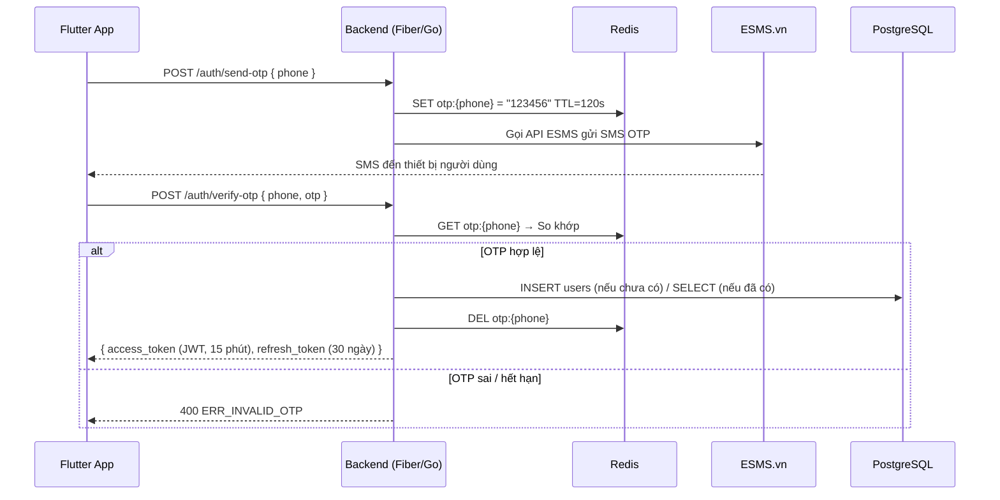
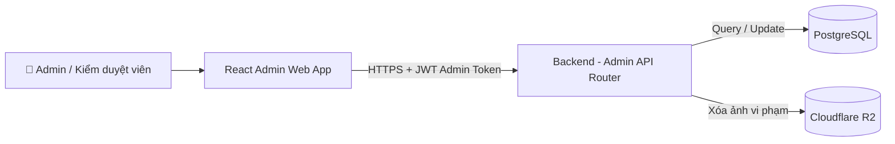
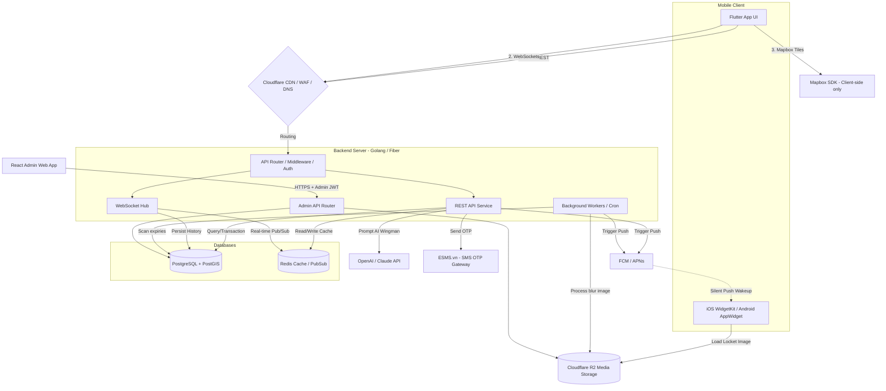

# Tài liệu Kiến trúc Hệ thống (System Architecture)
**Project Name:** Q-Love - Super App Hẹn Hò & Mạng Xã Hội Giải Trí  
**Mục đích:** Mô tả bức tranh tổng thể về cách các thành phần (Front-end, Back-end, Database, External Services) kết nối và tương tác với nhau.

---

## 1. Sơ đồ Kiến trúc Tổng thể (High-Level Architecture)

Sơ đồ dưới đây mô tả luồng dữ liệu và vị trí của các khối công nghệ đã được chốt trong `tech_stack.md`.

```mermaid
graph TD
    %% Mobile Client Side
    subgraph Client [Mobile Client]
        A[Flutter App UI]
        B[iOS WidgetKit / Android AppWidget]
    end

    %% Edge & Storage
    C{Cloudflare (CDN, WAF, DNS)}
    D[(Cloudflare R2 Media Storage)]

    %% Backend Infrastructure
    subgraph Backend_Golang [Backend Server - Golang]
        E[API Router / Middleware]
        F[REST API Service (CRUD, Auth)]
        G[WebSocket Hub (Chat, Stock, Map)]
        H[Background Workers / Cron (Image Blur, Streak)]
    end

    %% Databases
    subgraph DB_Layer [Databases]
        I[(PostgreSQL + PostGIS)]
        J[(Redis Cache / PubSub)]
    end

    %% 3rd Party Services
    K[OpenAI / Claude API]
    L[FCM / APNs]

    %% Interactions
    A -- "1. HTTP/REST" --> C
    A -- "2. WebSockets" --> C
    B -- "3. Load Image" --> D
    
    C -- "Routing" --> E
    
    E --> F
    E --> G
    
    F -- "Query/Transaction" --> I
    F -- "Read/Write" --> J
    G -- "Real-time Pub/Sub" --> J
    G -- "Persist History" --> I
    
    H -- "Scan expiries" --> I
    H -- "Process blur image" --> D
    F -- "Prompt AI Wingman" --> K
    
    F -- "Trigger" --> L
    H -- "Trigger" --> L
    L -. "4. Silent Push Wakeup" .-> B
```

---

## 2. Giải nghĩa các Khối Kiến trúc (Component Details)

### 2.1. Tầng Client (Mobile)
- **Flutter App UI:** Chịu trách nhiệm hiển thị giao diện mượt mà (60-120fps), render Bản đồ Mapbox, và các hiệu ứng Gamification (Đảo 3D, Quẹt thẻ). Giao tiếp với Server qua 2 kênh: HTTP/REST (cho các tác vụ tải dữ liệu thông thường) và WebSockets (cho Chat và Game).
- **Native Widgets (WidgetKit/AppWidget):** Chạy độc lập ngoài màn hình khóa/màn hình chính. Nó chỉ đóng vai trò "Nhận lệnh" và "Hiển thị ảnh Locket" từ Cloudflare R2, hoàn toàn không dính dáng đến logic nặng của App.

### 2.2. Tầng Mạng & Lưu Trữ (Edge Network & Media)
- **Cloudflare (CDN / Routing):** Hoạt động như một lá chắn bảo mật (DDoS) và định tuyến request từ Client tới đúng Server. 
- **Cloudflare R2:** Lưu trữ toàn bộ ảnh Avatar, ảnh Locket gốc và ảnh Locket đã bị làm mờ (Gaussian Blur). Tận dụng băng thông Egress miễn phí.

### 2.3. Tầng Backend (Golang Monolith)
Kiến trúc Backend được thiết kế theo dạng **Modular Monolith** bằng ngôn ngữ Golang để dễ triển khai (Deploy) nhưng vẫn chia rõ ranh giới các module:
- **REST API Service:** Xử lý các logic cơ bản (Đăng nhập, Sửa profile, Nạp Xu, Matchmaking, Tạo vụ án Tòa án).
- **WebSocket Hub:** Trái tim của hệ thống Real-time. Duy trì hàng vạn kết nối đồng thời. Xử lý logic nhảy giá Cổ phiếu ngay lập tức, chat 1-1, và đẩy tọa độ GPS Real-time khi chạy bo "Đêm săn mồi".
- **Background Workers (Cronjobs):** 
  - *Blur Image Worker:* Nhận ảnh từ user, dùng thư viện `bimg` (C++) để làm mờ ngay trên Server.
  - *Streak/Ghosting Checker:* Quét Database mỗi nửa đêm, nếu User không tương tác thì trừ Streak và làm "héo" đảo tình yêu.

### 2.4. Tầng Cơ sở dữ liệu (Database Layer)
- **PostgreSQL (PostGIS):** Lưu trữ persistent data (Dữ liệu vĩnh viễn). Sử dụng Transactions ở mức Serializable để tính toán biến động Xu an toàn.
- **Redis (In-memory):** 
  - Dùng để làm Pub/Sub (Phát sóng) tin nhắn chat giữa các Socket nodes.
  - Lưu trữ trạng thái Online/Offline của User.
  - Cache lại danh sách "Người quanh đây" để giảm tải cho PostGIS.

### 2.5. External Services (Dịch vụ bên thứ ba)
- **FCM / APNs (Push Notification):** Cực kỳ quan trọng để gửi "Silent Push" (Thông báo ngầm) xuống máy User B. Khi máy User B nhận được tín hiệu này, nó sẽ âm thầm đánh thức (Wake up) cái Widget Locket để tải ảnh mờ mới về hiển thị mà không cần bật màn hình.
- **OpenAI/Claude API:** Xử lý text thông minh cho tính năng Trợ lý ảo (AI Wingman).

---

## 3. Luồng Dữ liệu Đặc thù (Special Data Flows)

### 3.1. Luồng hoạt động của Widget Locket
1. **User A** chụp ảnh qua Widget -> Gửi HTTP Request kèm file ảnh lên **Backend (REST API)**.
2. **Backend** lưu ảnh gốc lên **Cloudflare R2**.
3. **Backend** kiểm tra `streak_score` trong **PostgreSQL**.
4. **Backend (Worker)** xử lý làm mờ ảnh (Blur) và lưu bản mờ đè lên bản gốc ở **R2**.
5. **Backend** gọi API của **FCM/APNs** để bắn Silent Push.
6. **Widget User B** nhận Silent Push -> Tự động gọi URL tải ảnh từ **Cloudflare R2** về hiển thị.
 *(Tất cả quá trình này diễn ra dưới 3 giây)*

### 3.2. Luồng giao dịch Khế Ước (Dating Contract)
1. **User A** tạo khế ước đi Date -> **Backend** tạo Transaction, trừ `balance` và cộng `hold_balance` (ví đóng băng) trong **PostgreSQL**.
2. **User B** bấm Đồng ý -> Backend lặp lại logic đóng băng ví của User B.
3. Khi 2 người quét mã QR cách nhau dưới 100 mét (Validate GPS bằng **PostGIS**), Backend Commit Transaction: Hủy `hold_balance`, hoàn lại tiền cho cả 2.

---

## 4. Quy chuẩn Cấu trúc Thư mục (Folder Structure Best Practices 2026)

Để đảm bảo dự án dễ bảo trì và có thể mở rộng (scale) nhân sự trong tương lai, toàn bộ Source Code sẽ tuân thủ nghiêm ngặt các tiêu chuẩn kiến trúc hiện đại nhất hiện nay.

### 4.1. Mobile Client (Flutter) - Feature-First Architecture
Sử dụng kiến trúc **Feature-First** (Chia thư mục theo tính năng) kết hợp **Clean Architecture** (Bên trong mỗi tính năng lại chia 3 tầng). Đây là tiêu chuẩn vàng của cộng đồng Flutter năm 2026 giúp Codebase không bị phình to (Spaghetti Code) và cực kỳ dễ fix bug.

```text
lib/
├── core/                   # Code dùng chung toàn App
│   ├── network/            # Cấu hình API Client (Dio, Interceptors)
│   ├── theme/              # Colors, Fonts, AppTheme
│   ├── utils/              # Hàm dùng chung, Constants
│   └── widgets/            # UI components tái sử dụng (Buttons, Dialogs)
├── features/               # Các cụm tính năng nghiệp vụ độc lập
│   ├── auth/               # Cụm Đăng nhập / Đăng ký
│   │   ├── data/           # Models, Data Sources (API calls), Repositories
│   │   ├── domain/         # Entities, Use cases (Business Rules)
│   │   └── presentation/   # Screens, Controllers (Riverpod/Bloc)
│   ├── dating_contract/    # Cụm tính năng Khế Ước
│   ├── locket_widget/      # Cụm tính năng chụp ảnh Locket
│   ├── court_cases/        # Cụm tính năng Tòa Án
│   └── map_clan/           # Cụm tính năng Bản đồ & Bang hội
├── app.dart                # Cấu hình Router, Root Widget, Dependency Injection
└── main.dart               # Entry point (Khởi chạy app)
```

### 4.2. Backend Server (Golang) - Standard Project Layout
Tuyệt đối không nhét chung code vào thư mục gốc. Sử dụng bộ khung tiêu chuẩn của cộng đồng Go (`golang-standards/project-layout`) kết hợp tư duy **Modular Monolith** (Đơn thể chia module).

```text
/cmd
  └── server/               # Điểm khởi chạy hệ thống (chứa main.go)
/internal                   # Code Private cốt lõi (Không thể bị import từ dự án khác)
  ├── config/               # Load biến môi trường, setup config DB/Redis
  ├── core/                 # Entities, Interfaces (Domain layer)
  ├── handler/              # Nhận Request (HTTP/REST/WebSocket Handlers)
  ├── service/              # Xử lý Logic kinh doanh (Trừ tiền, Tính toán)
  ├── repository/           # Giao tiếp với Database (PostgreSQL, Redis)
  └── worker/               # Cronjobs chạy ngầm (Trừ Streak, Làm mờ ảnh)
/pkg                        # Các thư viện tiện ích tự viết (Logger, JWT Utils)
/migrations                 # SQL files để tự động tạo/sửa bảng DB (PostgreSQL)
docker-compose.yml          # Cấu hình môi trường dev cục bộ
go.mod                      # File quản lý Dependencies
```

---

## 5. Luồng Xác thực (Authentication Flow)

### 5.1. Đăng ký / Đăng nhập bằng OTP



### 5.2. Làm mới Access Token (Token Rotation)
- Flutter App tự động gửi `POST /auth/refresh` với `refresh_token` khi Access Token hết hạn.
- Backend xác thực Refresh Token từ DB, **vô hiệu hóa token cũ ngay lập tức** (One-time use) và cấp cặp token mới.
- Nếu Refresh Token hết hạn, người dùng phải đăng nhập lại bằng OTP.

**Lưu ý bảo mật:**
- `access_token`: Lưu trong bộ nhớ RAM của Flutter App (không lưu vào ổ đĩa).
- `refresh_token`: Lưu vào `flutter_secure_storage` (iOS Keychain / Android Keystore).

---

## 6. Kiến trúc Admin / CMS Dashboard

Admin Dashboard là một **web app React riêng biệt**, giao tiếp với backend qua một API Route riêng (`/admin/v1/...`) được bảo vệ bằng IP Whitelist và JWT Role-based (`role: admin`).



**Các module Admin chính:**
| Module | Chức năng |
| :--- | :--- |
| **Content Moderation** | Duyệt/Xóa ảnh vi phạm NSFW bị báo cáo, xem log `user_violations` |
| **Court Management** | Xem, can thiệp hoặc dismiss các vụ kiện Tòa Án đang diễn ra |
| **Wallet & Finance** | Đối soát giao dịch Xu, xem `wallet_transactions` toàn hệ thống |
| **User Management** | Ban/Unban tài khoản, xóa huy hiệu, gỡ Shadowban thủ công |
| **Voucher Management** | Tạo và quản lý mã Voucher đổi Xu (Highlands, CGV...) |
| **Stock Circuit Breaker** | Bật/Tắt thủ công lệnh tạm dừng giao dịch của một mã cổ phiếu |

---

## 7. Cập nhật Sơ đồ Kiến trúc Tổng thể (v1.1)

Sơ đồ bổ sung node **SMS Gateway (ESMS.vn)**, **Mapbox SDK** và **Admin Web App** so với phiên bản v1.0.


