# Entity Relationship Diagram (ERD) & Database Schema
**Project Name:** Q-Love - Super App Hẹn Hò & Mạng Xã Hội Giải Trí  
**Database Engine:** PostgreSQL (kết hợp PostGIS cho dữ liệu không gian/GPS)  

Tài liệu này đặc tả thiết kế Cơ sở dữ liệu (Database Schema) dựa trên các Use-case và logic kinh doanh đã được chốt ở Phase 1, 2, và 3.

---

## 1. Sơ đồ thực thể liên kết (Visual ERD)
Sơ đồ dưới đây mô tả mối quan hệ giữa các bảng chính trong hệ thống.

```mermaid
erDiagram
    USERS ||--o| USER_WALLETS : "has"
    USERS ||--o| USER_PREMIUMS : "has"
    USERS ||--o{ MATCHES : "user1 / user2"
    USERS ||--o{ CHAT_MESSAGES : "sends"
    USERS ||--o{ CLAN_MEMBERS : "joins"
    CLANS ||--o{ CLAN_MEMBERS : "has"
    CLANS ||--o{ LANDMARKS : "owns"
    MATCHES ||--o{ CHAT_MESSAGES : "contains"
    USERS ||--o{ COURT_CASES : "plaintiff / defendant"
    USERS ||--o{ DATING_CONTRACTS : "userA / userB"
    USERS ||--o| card_profiles : "is listed as"
    USERS ||--o{ card_transactions : "trades"
    card_profiles ||--o{ card_transactions : "receives"
    USERS ||--o{ EX_RATINGS : "reviews / is reviewed"
    USERS ||--o{ WALLET_TRANSACTIONS : "makes"
    COURT_CASES ||--o{ COURT_VOTES : "receives"
    USERS ||--o{ COURT_VOTES : "votes"
    USERS ||--o{ NOTIFICATIONS : "receives"
    USERS ||--o{ USER_VIOLATIONS : "has"
    USERS ||--o{ USER_VOUCHERS : "claims"
    VOUCHERS ||--o{ USER_VOUCHERS : "claimed as"

    USERS {
        uuid id PK
        varchar phone
        varchar name
        geometry location "PostGIS"
        int level
        boolean is_shadowbanned
    }
    USER_WALLETS {
        uuid user_id FK
        numeric balance "Xu"
    }
    USER_PREMIUMS {
        uuid user_id PK, FK
        timestamp expires_at
        timestamp created_at
        timestamp updated_at
    }
    VOUCHERS {
        uuid id PK
        varchar brand "Highlands, CGV"
        varchar code
        int value_xu
        varchar status "available, claimed, expired"
        timestamp expires_at
    }
    USER_VOUCHERS {
        uuid id PK
        uuid user_id FK
        uuid voucher_id FK
        timestamp claimed_at
    }
    MATCHES {
        uuid id PK
        uuid user1_id FK
        uuid user2_id FK
        int streak_score
        int highest_streak_score
        timestamp last_interaction_at
    }
    DATING_CONTRACTS {
        uuid id PK
        uuid user_a_id FK
        uuid user_b_id FK
        numeric deposit_amount
        varchar status
    }
    COURT_CASES {
        uuid id PK
        uuid plaintiff_id FK
        uuid defendant_id FK
        varchar status
    }
    CLAN_MEMBERS {
        uuid id PK
        uuid clan_id FK
        uuid user_id FK
        varchar role
        timestamp joined_at
    }
    CLANS {
        uuid id PK
        varchar name
        uuid leader_id FK
        int weekly_score
    }
    EX_RATINGS {
        uuid id PK
        uuid reviewer_id FK
        uuid target_id FK
        int rating_score
        timestamp deleted_at
    }
    NOTIFICATIONS {
        uuid id PK
        uuid user_id FK
        varchar type
        text payload
        varchar status
        uuid reference_id
        timestamp created_at
    }
    LANDMARKS {
        uuid id PK
        varchar name
        geometry location "PostGIS"
        int radius_meters
        uuid current_owner_clan_id FK
    }
    USER_VIOLATIONS {
        uuid id PK
        uuid user_id FK
        varchar type
        varchar reason
        timestamp expires_at
        timestamp created_at
    }
```

---

## 2. Chi tiết các bảng (Tables Details)

### 2.1. Cốt lõi & Tài khoản (Core & Account)

**Bảng `users`** (Lưu thông tin cơ bản)
| Column | Type | Constraints | Description |
| :--- | :--- | :--- | :--- |
| `id` | UUID | Primary Key | ID định danh duy nhất |
| `phone` | VARCHAR(20) | Unique, Not Null | Số điện thoại đăng nhập |
| `name` | VARCHAR(50) | Not Null | Tên hiển thị |
| `dob` | DATE | Not Null | Ngày sinh |
| `gender` | VARCHAR(10) | | Giới tính |
| `location` | GEOMETRY(Point, 4326) | PostGIS | Tọa độ GPS hiện tại (dùng cho map) |
| `level` | INT | Default 1 | Cấp độ người dùng |
| `clan_id` | UUID | FK(clans.id), Nullable | Bang hội người dùng đang tham gia |
| `is_shadowbanned` | BOOLEAN | Default false | Bị phạt bóp tương tác do Tòa án |
| `created_at` | TIMESTAMP | Default NOW() | |
| `deleted_at` | TIMESTAMP | | Hỗ trợ Xóa mềm (Soft Delete) |

**Bảng `user_wallets`** (Ví lưu trữ Xu ảo - Cực kỳ quan trọng, cần tính ACID)
| Column | Type | Constraints | Description |
| :--- | :--- | :--- | :--- |
| `user_id` | UUID | PK, FK(users.id) | |
| `balance` | NUMERIC(15,2) | Default 0.00 | Số dư Xu khả dụng |
| `hold_balance`| NUMERIC(15,2) | Default 0.00 | Số dư Xu đang bị đóng băng (Cọc đi Date) |

**Bảng `wallet_transactions`** (Sổ cái giao dịch - Rất quan trọng để Audit)
| Column | Type | Constraints | Description |
| :--- | :--- | :--- | :--- |
| `id` | UUID | Primary Key | |
| `user_id` | UUID | FK(users.id) | |
| `amount` | NUMERIC | Not Null | Số lượng Xu (+ hoặc -) |
| `type` | VARCHAR(50) | | `deposit`, `contract_hold`, `penalty`, `card_trade`, vv... |
| `reference_id` | UUID | | ID của luồng phát sinh (VD: id của Dating Contract) |
| `created_at`| TIMESTAMP | Default NOW() | Thời gian giao dịch |
| `deleted_at` | TIMESTAMP | | Hỗ trợ Xóa mềm (Soft Delete) |

**Bảng `user_premiums`** (Quản lý quyền lợi thuê bao)
| Column | Type | Constraints | Description |
| :--- | :--- | :--- | :--- |
| `user_id` | UUID | PK, FK(users.id) | |
| `is_active` | BOOLEAN | Default false | Có đang dùng Premium không |
| `expires_at`| TIMESTAMP | | Hạn sử dụng gói |
| `free_cancel_left`| INT | Default 1 | Số lần được miễn trừ hủy cọc Date/tháng |

**Bảng `vouchers`** (Kho mã giảm giá)
| Column | Type | Constraints | Description |
| :--- | :--- | :--- | :--- |
| `id` | UUID | Primary Key | |
| `brand` | VARCHAR(50) | | Tên thương hiệu (VD: Highlands, CGV) |
| `code` | VARCHAR(50) | Unique | Mã Voucher thực tế |
| `value_xu` | INT | | Giá trị quy đổi bằng Xu |
| `status` | VARCHAR(20) | Default 'available' | `available`, `claimed`, `expired` |
| `expires_at`| TIMESTAMP | | Hạn dùng của mã |
| `created_at`| TIMESTAMP | Default NOW() | |

**Bảng `user_vouchers`** (Voucher user đã đổi)
| Column | Type | Constraints | Description |
| :--- | :--- | :--- | :--- |
| `id` | UUID | Primary Key | |
| `user_id` | UUID | FK(users.id) | |
| `voucher_id`| UUID | FK(vouchers.id) | Unique để tránh 1 mã gán 2 người |
| `claimed_at`| TIMESTAMP | Default NOW() | |

---

### 2.2. Tương tác & Matchmaking (Engagement)

**Bảng `matches`** (Lưu cặp đôi và Streak)
| Column | Type | Constraints | Description |
| :--- | :--- | :--- | :--- |
| `id` | UUID | Primary Key | |
| `user1_id` | UUID | FK(users.id) | |
| `user2_id` | UUID | FK(users.id) | |
| `streak_score`| INT | Default 0 | Điểm chuỗi tương tác (Streak hiện tại) |
| `highest_streak_score`| INT | Default 0 | Điểm chuỗi cao nhất (Dùng cho điều kiện Tòa án) |
| `island_level`| INT | Default 1 | Cấp độ Đảo Tình Yêu 3D |
| `last_interaction_at` | TIMESTAMP | | Thời gian nhắn/gửi locket cuối cùng |

**Bảng `chat_messages`** (Tin nhắn & Locket)
| Column | Type | Constraints | Description |
| :--- | :--- | :--- | :--- |
| `id` | UUID | Primary Key | |
| `match_id` | UUID | FK(matches.id)| |
| `sender_id` | UUID | FK(users.id) | |
| `type` | VARCHAR(20) | | Loại tin: `text`, `locket` |
| `content` | TEXT | | Nội dung text hoặc URL ảnh gốc |
| `blur_url` | TEXT | | URL ảnh đã làm mờ (Nếu type = locket) |
| `blur_level`| INT | | Tỷ lệ mờ (90, 50, 0) phụ thuộc Streak |
| `created_at`| TIMESTAMP | Default NOW() | Thời gian gửi tin nhắn |

**Bảng `ex_ratings`** (Đánh giá CV Tình trường)
| Column | Type | Constraints | Description |
| :--- | :--- | :--- | :--- |
| `id` | UUID | Primary Key | |
| `reviewer_id` | UUID | FK(users.id) | Người đánh giá (Hiển thị ẩn danh) |
| `target_id` | UUID | FK(users.id) | Người bị đánh giá |
| `rating_score`| INT | Check(1-5) | Điểm số (1 đến 5 sao) |
| `tags` | TEXT[] | | Mảng các tag nhận xét (VD: #RedFlag) |
| `created_at` | TIMESTAMP | Default NOW() | |
| `deleted_at` | TIMESTAMP | | |
**Bảng `wingman_referrals`** (Nghề Cò Mối)
| Column | Type | Constraints | Description |
| :--- | :--- | :--- | :--- |
| `id` | UUID | Primary Key | |
| `wingman_id` | UUID | FK(users.id) | Người mai mối |
| `target1_id` | UUID | FK(users.id) | Đối tượng 1 |
| `target2_id` | UUID | FK(users.id) | Đối tượng 2 |
| `match_id` | UUID | FK(matches.id), Nullable | Match được tạo nếu thành công |
| `status` | VARCHAR(20) | Default 'pending' | pending, matched, dated, rewarded |
| `deep_link` | VARCHAR(255) | | Link chia sẻ |
| `created_at` | TIMESTAMP | Default NOW() | |
| `expires_at` | TIMESTAMP | | Thời gian hết hạn lời mời |

---

### 2.3. O2O & Gamification (Khế Ước, Bản Đồ, Tòa Án)

**Bảng `dating_contracts`** (Khế ước Hẹn hò - Dating Contract)
| Column | Type | Constraints | Description |
| :--- | :--- | :--- | :--- |
| `id` | UUID | Primary Key | |
| `user_a_id` | UUID | FK(users.id) | Người tạo khế ước |
| `user_b_id` | UUID | FK(users.id) | Người đồng ý |
| `deposit_amount` | NUMERIC | Not Null | Số Xu cọc mỗi bên (VD: 100) |
| `status` | VARCHAR(20) | | `pending`, `active`, `completed`, `cancelled` |
| `cancelled_by_id` | UUID | FK(users.id) | Lưu lại ai là người hủy kèo để trừ tiền phạt |
| `totp_secret` | VARCHAR(255)| | Secret Key để sinh mã Dynamic QR (thuật toán TOTP) |
| `appointment_time` | TIMESTAMP | | Giờ hẹn dự kiến |
| `created_at` | TIMESTAMP | Default NOW() | |
| `deleted_at` | TIMESTAMP | | Hỗ trợ Xóa mềm (Soft Delete) |

**Bảng `landmarks`** (Địa bàn Clan)
| Column | Type | Constraints | Description |
| :--- | :--- | :--- | :--- |
| `id` | UUID | Primary Key | |
| `name` | VARCHAR(100) | | Tên địa điểm (VD: Phố Đi Bộ) |
| `location` | GEOMETRY(Point) | PostGIS | Tọa độ điểm mù |
| `radius_meters` | INT | Default 200 | Bán kính hợp lệ để check-in (ST_DWithin) |
| `current_owner_clan_id`| UUID | FK(clans.id) | Bang hội đang chiếm cờ |

**Bảng `clans`** (Bang hội)
| Column | Type | Constraints | Description |
| :--- | :--- | :--- | :--- |
| `id` | UUID | Primary Key | |
| `name` | VARCHAR(100) | Unique | Tên bang hội |
| `leader_id` | UUID | FK(users.id) | Bang chủ |
| `weekly_score` | INT | Default 0 | Điểm tuần (từ GPS check-in) |
| `campfire_streak`| INT | Default 0 | Số ngày giữ được Lửa Trại |
| `daily_active_members` | INT | Default 0 | Số người tương tác trong ngày (Reset 00:00) |
| `last_campfire_at` | TIMESTAMP | | Thời gian tiếp củi lần cuối |

**Bảng `clan_members`** (Thành viên Bang hội)
| Column | Type | Constraints | Description |
| :--- | :--- | :--- | :--- |
| `clan_id` | UUID | PK, FK(clans.id) | |
| `user_id` | UUID | PK, FK(users.id) | |
| `role` | VARCHAR(20) | Default 'member' | Vai trò (leader, member) |
| `joined_at` | TIMESTAMP | Default NOW() | |

**Bảng `court_cases`** (Tòa Án Tình Yêu)
| Column | Type | Constraints | Description |
| :--- | :--- | :--- | :--- |
| `id` | UUID | Primary Key | |
| `plaintiff_id` | UUID | FK(users.id) | Nguyên đơn (Người kiện) |
| `defendant_id` | UUID | FK(users.id) | Bị đơn (Người bị kiện) |
| `reason` | VARCHAR(100) | | Lý do kiện (Ghosting, Trap...) |
| `status` | VARCHAR(20) | | `voting`, `guilty`, `not_guilty`, `settled` (Hòa giải) |
| `created_at` | TIMESTAMP | Default NOW() | |
| `expires_at` | TIMESTAMP | | Thời điểm kết thúc vụ kiện (12h) |
| `deleted_at` | TIMESTAMP | | Hỗ trợ Xóa mềm (Soft Delete) |

**Bảng `court_votes`** (Phiếu bầu của Bồi thẩm đoàn)
| Column | Type | Constraints | Description |
| :--- | :--- | :--- | :--- |
| `case_id` | UUID | PK, FK(court_cases.id)| Vụ án nào |
| `juror_id` | UUID | PK, FK(users.id) | Người bỏ phiếu (Jury) |
| `vote` | VARCHAR(20) | | `guilty` (Có tội) hoặc `not_guilty` (Trắng án) |
| `created_at`| TIMESTAMP | Default NOW() | |

---

### 2.4. Kinh Tế Ảo (Chợ Thẻ Bài Profile)

**Bảng `card_profiles`** (Định giá Profile)
| Column | Type | Constraints | Description |
| :--- | :--- | :--- | :--- |
| `user_id` | UUID | PK, FK(users.id) | Chủ sở hữu profile ($Mã) |
| `current_price` | NUMERIC(15,2) | Default 100 | Giá hiện tại (Tính bằng công thức) |
| `total_cards` | INT | Default 1000 | Tổng cung Thẻ Bài |
| `available_cards` | INT | Default 1000 | Số Thẻ Bài tự do lưu hành (chưa bị mua) |
| `match_count_cached` | INT | Default 0 | Caching số lượt match mới (phục vụ tính giá) |
| `locket_count_cached` | INT | Default 0 | Caching số lượt gửi Locket (phục vụ tính giá) |
| `clan_upvote_cached` | INT | Default 0 | Caching số lượt Clan upvote (phục vụ tính giá) |
| `court_penalty_cached` | INT | Default 0 | Caching số đơn kiện Tòa án (phục vụ tính giá) |

**Bảng `card_transactions`** (Giao dịch Mua/Bán)
| Column | Type | Constraints | Description |
| :--- | :--- | :--- | :--- |
| `id` | UUID | Primary Key | |
| `collector_id` | UUID | FK(users.id) | Người đặt lệnh |
| `target_user_id`| UUID | FK(users.id) | Thẻ Bài của Profile nào |
| `type` | VARCHAR(10) | | `buy` hoặc `sell` |
| `quantity` | INT | | Số lượng |
| `price_at_transaction` | NUMERIC | | Giá khớp lệnh |

---

### 2.5. Hệ thống Thông báo & Vi phạm (Notification & Violation)

**Bảng `notifications`** (Lịch sử thông báo Push/In-app - phục vụ Audit & Debug)
| Column | Type | Constraints | Description |
| :--- | :--- | :--- | :--- |
| `id` | UUID | Primary Key | |
| `user_id` | UUID | FK(users.id) | Người nhận thông báo |
| `type` | VARCHAR(50) | Not Null | Loại: `locket_received`, `match`, `court_verdict`, `contract_reminder`... |
| `payload` | TEXT | | JSON payload đầy đủ (URL ảnh, case_id...) |
| `status` | VARCHAR(20) | Default 'sent' | Trạng thái: `sent`, `delivered`, `failed` |
| `reference_id` | UUID | | ID của đối tượng liên quan (match_id, case_id...) |
| `created_at` | TIMESTAMP | Default NOW() | |

**Bảng `user_violations`** (Lịch sử vi phạm - phục vụ Auto-ban & Admin)
| Column | Type | Constraints | Description |
| :--- | :--- | :--- | :--- |
| `id` | UUID | Primary Key | |
| `user_id` | UUID | FK(users.id) | Người vi phạm |
| `type` | VARCHAR(50) | Not Null | Loại vi phạm: `nsfw_image`, `fake_gps`, `purge_ban`, `court_shadowban`... |
| `reason` | TEXT | | Mô tả chi tiết vi phạm |
| `is_active` | BOOLEAN | Default true | Lệnh phạt còn hiệu lực hay không |
| expires_at   | timestamp   | Thời điểm hết hạn hiệu lực vi phạm (Soft Ban / Shadowban) |

### 2.6. Bang hội (Clans)

**Bảng: CLANS**
| Cột | Kiểu dữ liệu | Mô tả |
| :--- | :--- | :--- |
| id | uuid | Khóa chính (PK) |
| name | varchar | Tên Bang hội |
| leader_id | uuid | ID của người thành lập (FK -> users.id) |
| weekly_score | int | Điểm số trong tuần của bang hội |
| created_at | timestamp | Thời gian tạo bang hội |

**Bảng: CLAN_MEMBERS**
| Cột | Kiểu dữ liệu | Mô tả |
| :--- | :--- | :--- |
| id | uuid | Khóa chính (PK) |
| clan_id | uuid | ID Bang hội (FK -> clans.id) |
| user_id | uuid | ID thành viên (FK -> users.id) |
| role | varchar | Vai trò (member, elder, leader) |
| joined_at | timestamp | Thời gian gia nhập |

### 2.6. Gamification Đột Phá (Bounty & Đấu Giá)

**Bảng `bounties`** (Bảng Truy Nã Hẹn Hò)
| Column | Type | Constraints | Description |
| :--- | :--- | :--- | :--- |
| `id` | UUID | Primary Key | |
| `user_id` | UUID | FK(users.id) | Người đăng Bounty |
| `description` | TEXT | | Mô tả (VD: Cần người đi xem phim) |
| `reward_amount` | INT | | Số Xu thưởng |
| `status` | VARCHAR(20) | Default 'open' | `open`, `matched`, `completed`, `cancelled` |
| `winner_id` | UUID | FK(users.id), Nullable | Người trúng tuyển |
| `created_at` | TIMESTAMP | Default NOW() | |

**Bảng `blind_auctions`** (Phiên Đấu Giá Đặc Quyền)
| Column | Type | Constraints | Description |
| :--- | :--- | :--- | :--- |
| `id` | UUID | Primary Key | |
| `target_user_id` | UUID | FK(users.id) | Profile Top-Tier bị đem đấu giá |
| `start_time` | TIMESTAMP | | |
| `end_time` | TIMESTAMP | | |
| `current_highest_bid`| INT | Default 0 | |
| `winner_id` | UUID | FK(users.id), Nullable | Người thắng cuộc |
| `status` | VARCHAR(20) | Default 'active' | `active`, `completed` |
| `deleted_at` | TIMESTAMP | | |

**Bảng `auction_bids`** (Lượt Trả Giá)
| Column | Type | Constraints | Description |
| :--- | :--- | :--- | :--- |
| `id` | UUID | Primary Key | |
| `auction_id` | UUID | FK(blind_auctions.id) | |
| `bidder_id` | UUID | FK(users.id) | |
| `bid_amount` | INT | | |
| `created_at` | TIMESTAMP | Default NOW() | |
| `deleted_at` | TIMESTAMP | | |

**Bảng `wall_of_shames`** (Tường Thành Phong Sát)
| Column | Type | Constraints | Description |
| :--- | :--- | :--- | :--- |
| `id` | UUID | Primary Key | |
| `user_id` | UUID | FK(users.id) | Người bị phong sát |
| `reason` | TEXT | | Lý do (VD: Bùng kèo Tòa án) |
| `tomatoes_thrown`| INT | Default 0 | Số cà chua bị ném (1 quả = 1 Xu) |
| `expires_at` | TIMESTAMP | | Hết hạn sau 24h |
| `created_at` | TIMESTAMP | Default NOW() | |

**Bảng `vibe_checks`** (Ghép đôi Spotify)
| Column | Type | Constraints | Description |
| :--- | :--- | :--- | :--- |
| `id` | UUID | Primary Key | |
| `user1_id` | UUID | FK(users.id) | |
| `user2_id` | UUID | FK(users.id) | |
| `track_id` | VARCHAR(100) | | ID bài hát Spotify |
| `created_at` | TIMESTAMP | Default NOW() | |

**Bảng `wingman_referrals`** (Cò Mối - Ép Duyên)
| Column | Type | Constraints | Description |
| :--- | :--- | :--- | :--- |
| `id` | UUID | Primary Key | |
| `wingman_id` | UUID | FK(users.id) | Người làm mối |
| `target1_id` | UUID | FK(users.id) | |
| `target2_id` | UUID | FK(users.id) | |
| `status` | VARCHAR(20) | Default 'pending'| `pending`, `matched`, `dated`, `rewarded` |
| `created_at` | TIMESTAMP | Default NOW() | |

**Bảng `card_steals`** (Trận PK Cướp Thẻ)
| Column | Type | Constraints | Description |
| :--- | :--- | :--- | :--- |
| `id` | UUID | Primary Key | |
| `attacker_id` | UUID | FK(users.id) | Người cướp |
| `defender_id` | UUID | FK(users.id) | Người bị cướp |
| `target_card_id`| UUID | FK(users.id) | Thẻ Bài đang tranh giành |
| `result` | VARCHAR(20) | | `attacker_won`, `defender_won` |
| `created_at` | TIMESTAMP | Default NOW() | |

---

## 3. Tối ưu hóa Database (Database Optimization Notes)
1. **Ví ảo (User Wallets):** Phải sử dụng `BEGIN ... COMMIT` (Transactions) của PostgreSQL ở cấp độ Isolation `SERIALIZABLE` để tránh lỗi Race Condition khi 2 user cùng thao tác trừ/cộng Xu cùng lúc.
2. **Tìm kiếm GPS:** Bảng `users` và `landmarks` bắt buộc phải tạo Index `GIST(location)` trên PostGIS để thuật toán tìm "người quanh đây bán kính 5km" trả về kết quả < 50ms.
3. **Ghosting Checker:** Bảng `matches` sử dụng `last_interaction_at` để tạo Cronjob tự động quét mỗi đêm, nếu quá 24h thì trừ điểm Streak và đánh dấu "Héo úa" Đảo Tình Yêu.
4. **Bảng `notifications`:** Index trên `(user_id, status)` để query nhanh danh sách thông báo chưa đọc.
5. **Bảng `user_violations`:** Index trên `(user_id, type, expires_at)` để Cron Job quét và tự động gỡ lệnh ban khi hết hạn.

---

## 4. Changelog Schema

| Version | Ngày | Thay đổi |
| :--- | :--- | :--- |
| v1.4 | 2026-08-25 | Cập nhật `location`, `level`, `is_shadowbanned` cho `USERS` (Spiritual Match). |
| v1.3 | 2026-08-20 | Áp dụng Clan Cronjob cho các model `Landmark`, `Notification`. |
| v1.2 | 2026-08-20 | Áp dụng Soft Delete (`deleted_at`) cho `users`, `dating_contracts`, `court_cases`, `wallet_transactions`. Bỏ `ON DELETE CASCADE` ở các bảng nhạy cảm. |
| v1.1 | 2026-08-11 | Thêm bảng `notifications`, `user_violations`; Bổ sung cột `created_at` vào `chat_messages`; Thêm `available_cards` vào `card_profiles`; Thêm `radius_meters` vào `landmarks`. |
| v1.0 | 2026-08-11 | Khởi tạo schema ban đầu. |
