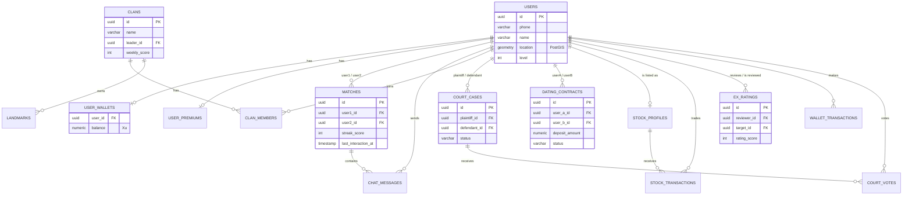

# Entity Relationship Diagram (ERD) & Database Schema
**Project Name:** Q-Love - Super App Hẹn Hò & Mạng Xã Hội Giải Trí  
**Database Engine:** PostgreSQL (kết hợp PostGIS cho dữ liệu không gian/GPS)  

Tài liệu này đặc tả thiết kế Cơ sở dữ liệu (Database Schema) dựa trên các Use-case và logic kinh doanh đã được chốt ở Phase 1, 2, và 3.

---

## 1. Sơ đồ thực thể liên kết (Visual ERD)
Sơ đồ dưới đây mô tả mối quan hệ giữa các bảng chính trong hệ thống.

---

## 2. Chi tiết các bảng (Tables Details)

### 2.1. Cốt lõi & Tài khoản (Core & Account)

**Bảng `users`** (Lưu thông tin cơ bản)
| Column | Type | Constraints | Description |
| :--- | :--- | :--- | :--- |
| `id` | UUID | Primary Key | ID định danh duy nhất |
| `phone` | VARCHAR(20) | Unique, Not Null | Số điện thoại đăng nhập |
| `name` | VARCHAR(50) | Not Null | Tên hiển thị |
| `dob` | DATE | Not Null | Ngày sinh |
| `gender` | VARCHAR(10) | | Giới tính |
| `location` | GEOMETRY(Point, 4326) | PostGIS | Tọa độ GPS hiện tại (dùng cho map) |
| `level` | INT | Default 1 | Cấp độ người dùng |
| `is_shadowbanned` | BOOLEAN | Default false | Bị phạt bóp tương tác do Tòa án |
| `created_at` | TIMESTAMP | Default NOW() | |

**Bảng `user_wallets`** (Ví lưu trữ Xu ảo - Cực kỳ quan trọng, cần tính ACID)
| Column | Type | Constraints | Description |
| :--- | :--- | :--- | :--- |
| `user_id` | UUID | PK, FK(users.id) | |
| `balance` | NUMERIC(15,2) | Default 0.00 | Số dư Xu khả dụng |
| `hold_balance`| NUMERIC(15,2) | Default 0.00 | Số dư Xu đang bị đóng băng (Cọc đi Date) |

**Bảng `wallet_transactions`** (Sổ cái giao dịch - Rất quan trọng để Audit)
| Column | Type | Constraints | Description |
| :--- | :--- | :--- | :--- |
| `id` | UUID | Primary Key | |
| `user_id` | UUID | FK(users.id) | |
| `amount` | NUMERIC | Not Null | Số lượng Xu (+ hoặc -) |
| `type` | VARCHAR(50) | | `deposit`, `contract_hold`, `penalty`, `stock_trade`, vv... |
| `reference_id` | UUID | | ID của luồng phát sinh (VD: id của Dating Contract) |
| `created_at`| TIMESTAMP | Default NOW() | Thời gian giao dịch |

**Bảng `user_premiums`** (Quản lý quyền lợi thuê bao)
| Column | Type | Constraints | Description |
| :--- | :--- | :--- | :--- |
| `user_id` | UUID | PK, FK(users.id) | |
| `is_active` | BOOLEAN | Default false | Có đang dùng Premium không |
| `expires_at`| TIMESTAMP | | Hạn sử dụng gói |
| `free_cancel_left`| INT | Default 1 | Số lần được miễn trừ hủy cọc Date/tháng |

---

### 2.2. Tương tác & Matchmaking (Engagement)

**Bảng `matches`** (Lưu cặp đôi và Streak)
| Column | Type | Constraints | Description |
| :--- | :--- | :--- | :--- |
| `id` | UUID | Primary Key | |
| `user1_id` | UUID | FK(users.id) | |
| `user2_id` | UUID | FK(users.id) | |
| `streak_score`| INT | Default 0 | Điểm chuỗi tương tác (Streak) |
| `island_level`| INT | Default 1 | Cấp độ Đảo Tình Yêu 3D |
| `last_interaction_at` | TIMESTAMP | | Thời gian nhắn/gửi locket cuối cùng |

**Bảng `chat_messages`** (Tin nhắn & Locket)
| Column | Type | Constraints | Description |
| :--- | :--- | :--- | :--- |
| `id` | UUID | Primary Key | |
| `match_id` | UUID | FK(matches.id)| |
| `sender_id` | UUID | FK(users.id) | |
| `type` | VARCHAR(20) | | Loại tin: `text`, `locket` |
| `content` | TEXT | | Nội dung text hoặc URL ảnh gốc |
| `blur_url` | TEXT | | URL ảnh đã làm mờ (Nếu type = locket) |
| `blur_level`| INT | | Tỷ lệ mờ (90, 50, 0) phụ thuộc Streak |

**Bảng `ex_ratings`** (Đánh giá CV Tình trường)
| Column | Type | Constraints | Description |
| :--- | :--- | :--- | :--- |
| `id` | UUID | Primary Key | |
| `reviewer_id` | UUID | FK(users.id) | Người đánh giá (Hiển thị ẩn danh) |
| `target_id` | UUID | FK(users.id) | Người bị đánh giá |
| `rating_score`| INT | Check(1-5) | Điểm số (1 đến 5 sao) |
| `tags` | TEXT[] | | Mảng các tag nhận xét (VD: #RedFlag) |

---

### 2.3. O2O & Gamification (Khế Ước, Bản Đồ, Tòa Án)

**Bảng `dating_contracts`** (Khế ước đi Date)
| Column | Type | Constraints | Description |
| :--- | :--- | :--- | :--- |
| `id` | UUID | Primary Key | |
| `user_a_id` | UUID | FK(users.id) | Người tạo khế ước |
| `user_b_id` | UUID | FK(users.id) | Người đồng ý |
| `deposit_amount` | NUMERIC | Not Null | Số Xu cọc mỗi bên (VD: 100) |
| `status` | VARCHAR(20) | | `pending`, `active`, `completed`, `cancelled` |
| `cancelled_by_id` | UUID | FK(users.id) | Lưu lại ai là người hủy kèo để trừ tiền phạt |
| `qr_token` | VARCHAR(255)| | Mã Dynamic QR để quét gặp mặt |
| `appointment_time` | TIMESTAMP | | Giờ hẹn dự kiến |
| `created_at` | TIMESTAMP | Default NOW() | |

**Bảng `landmarks`** (Địa bàn Clan)
| Column | Type | Constraints | Description |
| :--- | :--- | :--- | :--- |
| `id` | UUID | Primary Key | |
| `name` | VARCHAR(100) | | Tên địa điểm (VD: Phố Đi Bộ) |
| `location` | GEOMETRY(Point) | PostGIS | Tọa độ điểm mù |
| `current_owner_clan_id`| UUID | FK(clans.id) | Bang hội đang chiếm cờ |

**Bảng `clans`** (Bang hội)
| Column | Type | Constraints | Description |
| :--- | :--- | :--- | :--- |
| `id` | UUID | Primary Key | |
| `name` | VARCHAR(100) | Unique | Tên bang hội |
| `leader_id` | UUID | FK(users.id) | Bang chủ |
| `weekly_score` | INT | Default 0 | Điểm tuần (từ GPS check-in) |

**Bảng `clan_members`** (Thành viên Bang hội)
| Column | Type | Constraints | Description |
| :--- | :--- | :--- | :--- |
| `clan_id` | UUID | PK, FK(clans.id) | |
| `user_id` | UUID | PK, FK(users.id) | |
| `role` | VARCHAR(20) | Default 'member' | Vai trò (leader, member) |
| `joined_at` | TIMESTAMP | Default NOW() | |

**Bảng `court_cases`** (Tòa Án Tình Yêu)
| Column | Type | Constraints | Description |
| :--- | :--- | :--- | :--- |
| `id` | UUID | Primary Key | |
| `plaintiff_id` | UUID | FK(users.id) | Nguyên đơn (Người kiện) |
| `defendant_id` | UUID | FK(users.id) | Bị đơn (Người bị kiện) |
| `reason` | VARCHAR(100) | | Lý do kiện (Ghosting, Trap...) |
| `status` | VARCHAR(20) | | `voting`, `guilty`, `settled` (Hòa giải) |
| `created_at` | TIMESTAMP | Default NOW() | |

**Bảng `court_votes`** (Phiếu bầu của Bồi thẩm đoàn)
| Column | Type | Constraints | Description |
| :--- | :--- | :--- | :--- |
| `case_id` | UUID | PK, FK(court_cases.id)| Vụ án nào |
| `juror_id` | UUID | PK, FK(users.id) | Người bỏ phiếu (Jury) |
| `vote` | VARCHAR(20) | | `guilty` (Có tội) hoặc `not_guilty` (Trắng án) |
| `created_at`| TIMESTAMP | Default NOW() | |

---

### 2.4. Kinh Tế Ảo (Sàn Chứng Khoán)

**Bảng `stock_profiles`** (Định giá Profile)
| Column | Type | Constraints | Description |
| :--- | :--- | :--- | :--- |
| `user_id` | UUID | PK, FK(users.id) | Chủ sở hữu profile ($Mã) |
| `current_price` | NUMERIC(15,2) | Default 100 | Giá hiện tại (Tính bằng công thức) |
| `total_supply` | INT | Default 1000 | Tổng cung cổ phiếu |

**Bảng `stock_transactions`** (Giao dịch Mua/Bán)
| Column | Type | Constraints | Description |
| :--- | :--- | :--- | :--- |
| `id` | UUID | Primary Key | |
| `trader_id` | UUID | FK(users.id) | Người đặt lệnh |
| `target_user_id`| UUID | FK(users.id) | Cổ phiếu của Profile nào |
| `type` | VARCHAR(10) | | `buy` hoặc `sell` |
| `quantity` | INT | | Số lượng |
| `price_at_transaction` | NUMERIC | | Giá khớp lệnh |

---

## 3. Tối ưu hóa Database (Database Optimization Notes)
1. **Ví ảo (User Wallets):** Phải sử dụng `BEGIN ... COMMIT` (Transactions) của PostgreSQL ở cấp độ Isolation `SERIALIZABLE` để tránh lỗi Race Condition khi 2 user cùng thao tác trừ/cộng Xu cùng lúc.
2. **Tìm kiếm GPS:** Bảng `users` và `landmarks` bắt buộc phải tạo Index `GIST(location)` trên PostGIS để thuật toán tìm "người quanh đây bán kính 5km" trả về kết quả < 50ms.
3. **Ghosting Checker:** Bảng `matches` sử dụng `last_interaction_at` để tạo Cronjob tự động quét mỗi đêm, nếu quá 24h thì trừ điểm Streak và đánh dấu "Héo úa" Đảo Tình Yêu.
